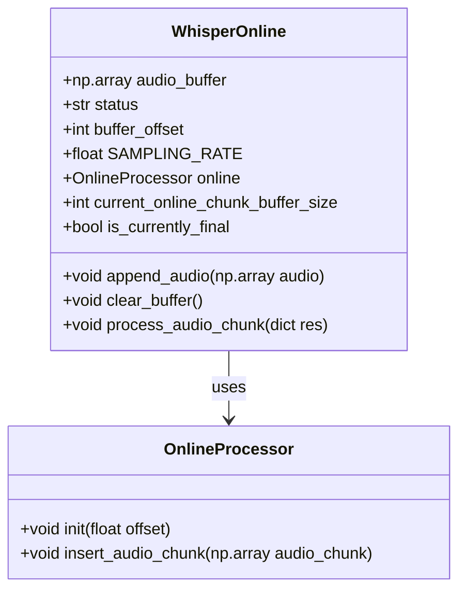

```mermaid
classDiagram
    class WhisperOnline {
        +np.array audio_buffer
        +str status
        +int buffer_offset
        +float SAMPLING_RATE
        +OnlineProcessor online
        +int current_online_chunk_buffer_size
        +bool is_currently_final
        +void append_audio(np.array audio)
        +void clear_buffer()
        +void process_audio_chunk(dict res)
    }

    class OnlineProcessor {
        +void init(float offset)
        +void insert_audio_chunk(np.array audio_chunk)
    }

    WhisperOnline --> OnlineProcessor : uses


```
